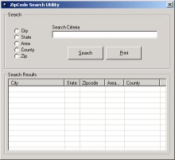



## ZipCode Utility

### Description

A simply utility to search US postal database.

You can search by city, state, areacode, zipcode, or county.
 
### More Info
 

             |
---                |---
**Submitted On**   |2001-10-02 08:26:46
**By**             |[L\. M\. Trivette ](https://github.com/Planet-Source-Code/PSCIndex/blob/master/ByAuthor/l-m-trivette.md)
**Level**          |Intermediate
**User Rating**    |4.7 (28 globes from 6 users)
**Compatibility**  |VB 6\.0
**Category**       |[Databases/ Data Access/ DAO/ ADO](https://github.com/Planet-Source-Code/PSCIndex/blob/master/ByCategory/databases-data-access-dao-ado__1-6.md)
**World**          |[Visual Basic](https://github.com/Planet-Source-Code/PSCIndex/blob/master/ByWorld/visual-basic.md)
**Archive File**   |[ZipCode Ut273601022001\.zip](https://github.com/Planet-Source-Code/l-m-trivette-zipcode-utility__1-27725/archive/master.zip)

